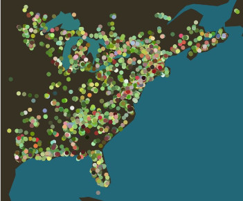

# Leaf-colors
### Analyzing leaf color of 10,950‬ [iNaturalist](https://www.inaturalist.org/) observations of Red Maple (*Acer rubrum*)

Using a deep learned based object detector, [leaf-detector](https://github.com/etowahs/leaf-detector), leaf positions in each image was detected. From there, the foreground was removed from the detected leaf using GrabCut algorithm ([opencv](https://docs.opencv.org/3.0-beta/doc/py_tutorials/py_imgproc/py_grabcut/py_grabcut.html)). Dominant color of the leaf was calculated using k-means clustering. 



Figure 1 (above): All the 2019 data plotted on the same map. The color of each observation marker corresponds to the dominant color of the leaves of the observation. 

## Usage 
``` python
from leafcolors.leafcolors import LeafColors

detector_output = 'output.txt'    # output of leaf-detector batch detection
img_folder = '2015/'             # folder of images that darknet detected 

my_analysis = LeafColors(darknet_output, img_folder)
```
For the output of leaf-detector, be sure to remove the first few lines of metadata before passing it to LeafColors. 
